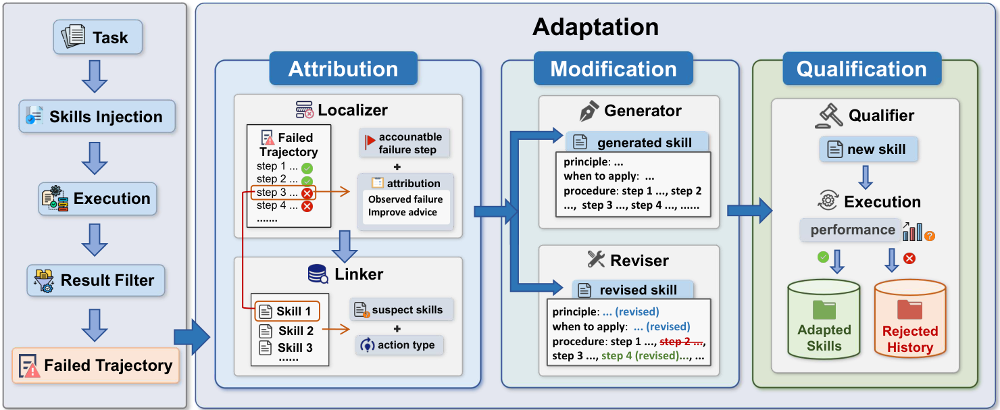

<div align="center">

# SkillAdaptor: Self-Adapting Skills for LLM Agents from Trajectories

[](https://opensource.org/licenses/MIT)
[](https://www.python.org/downloads/)
[](https://arxiv.org/abs/2606.01311)



[Installation](#installation) ·
[Quick start](#quick-start) ·
[Trajectory requirements](#trajectory-requirements) ·
[Configuration](#configuration) ·
[Agents](#agents) ·
[Citation](#citation)

</div>

---

**SkillAdaptor** evolves agent **`SKILL.md`** files from failure trajectories. Run it as a Python CLI on any workspace, or wire it into **OpenClaw**, **Claude Code**, **Codex CLI**, or **Hermes Agent** via `--harness`.

- **Step-level attribution** — On a failed run, the **Localizer** finds the earliest bad step **t★**; the **Linker** scores which injected skill caused it; **Reviser** patches or **Generator** creates a skill; **Validator** re-runs held-out tasks and adopts only on improvement.
- **Workspace output** — `skills/<id>/SKILL.md`, synced to your agent’s skill paths.
- **Flexible tasks** — `input_task/*.md`, `--manifest`, `auto_discover`, or `--input-trajectories`.
- **Retrieval-gated inject** — skills attach only when relevant.

PinchBench, WebShop, and Claw-Eval are optional executors (`--env` + path env vars). Custom task briefs work without them.

---

## Installation

### Clone & Python deps

```bash
git clone https://github.com/zjunlp/SkillAdaptor.git
cd SkillAdaptor/skill-adaptor
pip install -r requirements.txt
```

### Secrets

```bash
cd ..   # repo root
mkdir -p secrets
cp .env.example secrets/.env
# Edit secrets/.env — API keys & paths
```

```bash
# Linux / macOS
source scripts/load_secrets.sh

# Windows PowerShell
. scripts\load_secrets.ps1
```

### Agent harness

| Harness | Flag | Install guide |
|---------|------|---------------|
| OpenClaw | `--harness openclaw` | [plugin/openclaw/README.md](plugin/openclaw/README.md) |
| Claude Code | `--harness claude-code` | [below](#claude-code) |
| Codex CLI | `--harness codex` | [plugin/codex/README.md](plugin/codex/README.md) |
| Hermes Agent | `--harness hermes` | [plugin/hermes/README.md](plugin/hermes/README.md) |

OpenClaw live runs need a running gateway:

```bash
npm install -g openclaw
openclaw gateway start
openclaw gateway status
```

---

## Quick start

```bash
cd skill-adaptor
python run_plugin.py init --workspace ../my-workspace --harness claude-code
# Add *.md task briefs under ../my-workspace/input_task/
python run_plugin.py --workspace ../my-workspace --dry-run
python run_plugin.py --workspace ../my-workspace --max-iterations 2
```

**Task sources**

| Source | When to use |
|--------|-------------|
| `input_task/*.md` | Default — any custom tasks |
| `--manifest path.json` | Fixed train/val splits |
| `--mode auto_discover` | Auto-split from `PINCHBENCH_PATH` checkout |
| `--input-trajectories` | Seed failures from existing trajectory files |

**Workspace layout**

| Path | Role |
|------|------|
| `input_task/*.md` | Task briefs; ~20% held out as validation Q′ |
| `test_task/` | Optional extra held-out briefs |
| `skills/<id>/SKILL.md` | Adopted skills after Validator passes |

Use `--sync-tasks` after editing task files. With `--env workspace` (default when no benchmark path is set), tasks live in `input_task/` only.

---

## Trajectory requirements

Evolution runs on **tool steps** only. Each step must carry a tool-level `action`, for example:

```text
shell({"command": "grep ERROR app.log"})
write({"path": "report.txt", "content": "..."})
```

These do **not** qualify:

- `(assistant response)` — text-only turns
- Empty placeholders (`(no action)`, `(end)`, …)
- Runs with a score but no parseable tool trace

If a live run has no qualifying steps, SkillAdaptor raises `TaskExecutionError` instead of inventing a trajectory.

---

## Configuration

Load `secrets/.env` before running. Full template: [`.env.example`](.env.example).

### Chat & embeddings

Two independent **API key + base URL** pairs. Endpoints use a compatible chat API (`…/v1`). Switch chat models with `--model` only.

**Chat** (`SkillAdaptor_PROVIDER=auto`, default):

| Variable | Role |
|----------|------|
| `SkillEvolve_API_KEY` | Chat API key |
| `SkillEvolve_BASE_URL` | Chat endpoint (relay / DeepSeek / Kimi / GLM — same pair) |
| `SkillEvolve_MODEL` | Default model when `--model` omitted |

**Embedding** (always separate — skill–task matching):

| Variable | Role |
|----------|------|
| `SkillEvolve_EMBEDDING_API_KEY` | Embedding API key |
| `SkillEvolve_EMBEDDING_BASE_URL` | Embedding endpoint |
| `SkillEvolve_EMBEDDING_MODEL` | Model id (default `Qwen3-Embedding-8B`) |

If embedding key/URL are omitted, chat credentials are used as fallback. Prefer setting the embedding pair explicitly when the embedding host differs from chat.

```bash
# secrets/.env
SkillAdaptor_PROVIDER=auto
SkillEvolve_BASE_URL=https://your-relay.example.com/v1
SkillEvolve_API_KEY=sk-...
SkillEvolve_MODEL=gpt-4.1

SkillEvolve_EMBEDDING_API_KEY=sk-...
SkillEvolve_EMBEDDING_BASE_URL=https://your-embedding.example.com/v1
SkillEvolve_EMBEDDING_MODEL=Qwen3-Embedding-8B
```

DeepSeek via relay (no extra provider vars): keep `SkillAdaptor_PROVIDER=auto`, point `SkillEvolve_BASE_URL` at DeepSeek, use `--model deepseek-chat`.

After startup, `resolve_and_apply` writes the active chat pair to `SkillEvolve_API_KEY` / `SkillEvolve_BASE_URL` for downstream executors.

```bash
. scripts/load_secrets.ps1   # or source scripts/load_secrets.sh
cd skill-adaptor

python run_plugin.py --workspace ../my-workspace --model kimi-k2.5
```

**Alternate chat providers** — only when the gateway needs its own key/URL pair:

| `SkillAdaptor_PROVIDER` | Key | Base URL | Notes |
|-------------------------|-----|----------|-------|
| `deepseek` | `DEEPSEEK_API_KEY` → else `SkillEvolve_API_KEY` | `DEEPSEEK_API_BASE_URL` → else `SkillEvolve_BASE_URL` | Compatible `/v1` API; default base `https://api.deepseek.com/v1` |
| `openrouter` | `OPENROUTER_API_KEY` → else `SkillEvolve_API_KEY` | `OPENROUTER_API_BASE_URL` → else `SkillEvolve_BASE_URL` | Model ids use `vendor/model`; embedding falls back to gateway default when no separate embedding API |

Legacy provider names (`relay-gpt41`, `relay-kimi`, `gpt`, `glm`) map to `auto`.

### Other environment variables

| Variable | Purpose |
|----------|---------|
| `SkillAdaptor_PROVIDER` | Chat backend: `auto` (default), `deepseek`, `openrouter` |
| `SkillAdaptor_BENCHMARK_ENV` | Default executor when `--env` omitted: `pinchbench`, `claw-eval`, `webshop` |
| `SkillAdaptor_HARNESS` | Default harness: `openclaw`, `claude-code`, `codex`, `hermes` |
| `DEEPSEEK_MODEL` | Default DeepSeek model when `SkillAdaptor_PROVIDER=deepseek` and `--model` omitted |
| `OPENROUTER_MODEL` | Default OpenRouter model when `SkillAdaptor_PROVIDER=openrouter` and `--model` omitted |
| `PINCHBENCH_PATH` | PinchBench executor (`--env pinchbench`) |
| `CLAW_EVAL_PATH` | Claw-Eval executor (`--env claw-eval`) |
| `WEBSHOP_PATH` | WebShop executor (`--env webshop`) |
| `CODEX_HOME` | Codex home directory (default `~/.codex`) |
| `HERMES_HOME` | Hermes home directory (default `~/.hermes`) |
| `OPENCLAW_CLI` | Explicit `openclaw` binary path |
| `ALLOW_SYNTHETIC_TRAJECTORY` | `1` — one-step fallback when no tool trace (debug only) |

---

## Agents

### OpenClaw

TypeScript UI plugin + Python bridge. Configure in `openclaw.json`:

```json
{
  "skillAdaptorRoot": "/absolute/path/to/skill-adaptor/skill-adaptor",
  "pythonCommand": "python",
  "benchmarkEnv": "pinchbench",
  "maxIterations": 2
}
```

Details: [plugin/openclaw/README.md](plugin/openclaw/README.md).

### Claude Code

Skills sync to `.claude/skills/`.

```bash
python run_plugin.py init --workspace /path/to/your-project --harness claude-code
python run_plugin.py --workspace /path/to/your-project --harness claude-code
```

PinchBench validation (`--env pinchbench`) runs tasks through the OpenClaw gateway and needs `PINCHBENCH_PATH`.

### Codex CLI

Skills sync to `~/.codex/skills/` and `<workspace>/.agents/skills/`.

```bash
python run_plugin.py init --workspace /path/to/your-project --harness codex
python run_plugin.py --workspace /path/to/your-project --harness codex
```

Enable `[features] skills = true` in `~/.codex/config.toml` and restart Codex. Marketplace plugin steps: [plugin/codex/README.md](plugin/codex/README.md).

### Hermes Agent

Skills sync to `~/.hermes/skills/skill-adaptor/`.

```bash
python run_plugin.py init --workspace /path/to/your-project --harness hermes
python run_plugin.py --workspace /path/to/your-project --harness hermes
```

Profile paths and operator skill: [plugin/hermes/README.md](plugin/hermes/README.md).

---

## Citation

```bibtex
@misc{yu2026skilladaptor,
  title={SkillAdaptor: Self-Adapting Skills for LLM Agents from Trajectories},
  author={Zhuoyun Yu and Xin Xie and Wuguannan Yao and Chenxi Wang and Lei Liang and Xiang Qi and Shumin Deng},
  year={2026},
  eprint={2606.01311},
  archivePrefix={arXiv},
  primaryClass={cs.AI},
  url={https://arxiv.org/abs/2606.01311}
}
```

---

## License

[MIT License](https://opensource.org/licenses/MIT)
